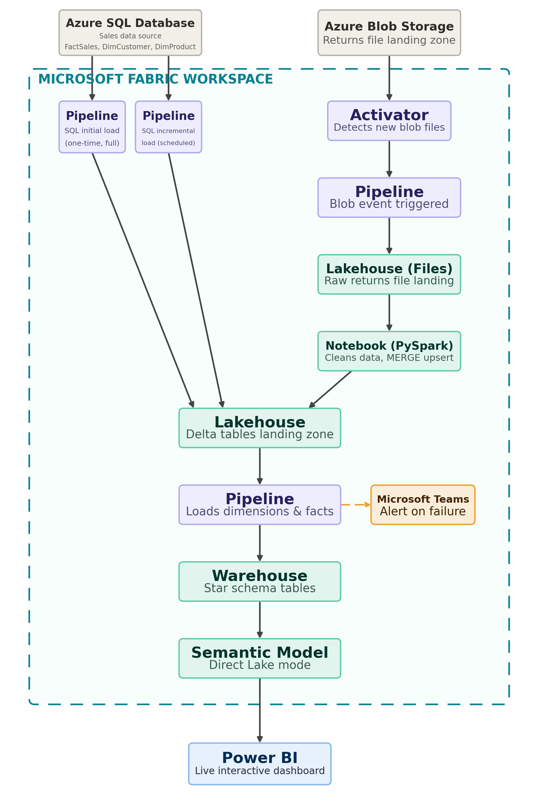

# End-to-End Architecture

This document explains the end-to-end architecture of the Sales & Returns Analytics project built using Microsoft Fabric and Azure data sources.

## Architecture Overview

The solution integrates sales data from Azure SQL Database and returns data from Azure Blob Storage into Microsoft Fabric for processing, transformation, analytics, and reporting.

## Data Sources

### Azure SQL Database

Azure SQL Database is the source for sales data.

Source tables include:

- FactSales
- DimCustomer
- DimProduct

Two Microsoft Fabric pipelines are used:

- **PL_AzureSQL_InitialLoad** - Performs a one-time full load of the source data.
- **PL_AzureSQL_IncrementalLoad** - Performs scheduled incremental loads using watermark-based processing.

The data is loaded into the Microsoft Fabric Lakehouse as Delta tables.

### Azure Blob Storage

Azure Blob Storage is the source for returns CSV files.

The returns processing flow is event-driven:

1. Activator detects a new blob file.
2. A Fabric pipeline is triggered.
3. The raw returns file is landed in the Lakehouse Files area.
4. A PySpark notebook cleans and transforms the data.
5. The processed data is merged into Lakehouse Delta tables.

## Lakehouse Processing

The Microsoft Fabric Lakehouse acts as the central data platform.

It stores:

- Sales Delta tables from Azure SQL Database
- Raw returns files
- Processed returns Delta tables

## Lakehouse to Warehouse

A Fabric pipeline loads processed data from the Lakehouse into the Fabric Warehouse.

The Warehouse contains star schema tables, including dimension and fact tables.

## Semantic Model and Reporting

The Fabric Semantic Model connects to the Warehouse using Direct Lake.

The Semantic Model is then used to build an interactive Power BI dashboard for Sales and Returns Analytics.

## Monitoring and Alerts

Pipeline execution is monitored, and Microsoft Teams alerts are configured to notify stakeholders in case of pipeline failures.
